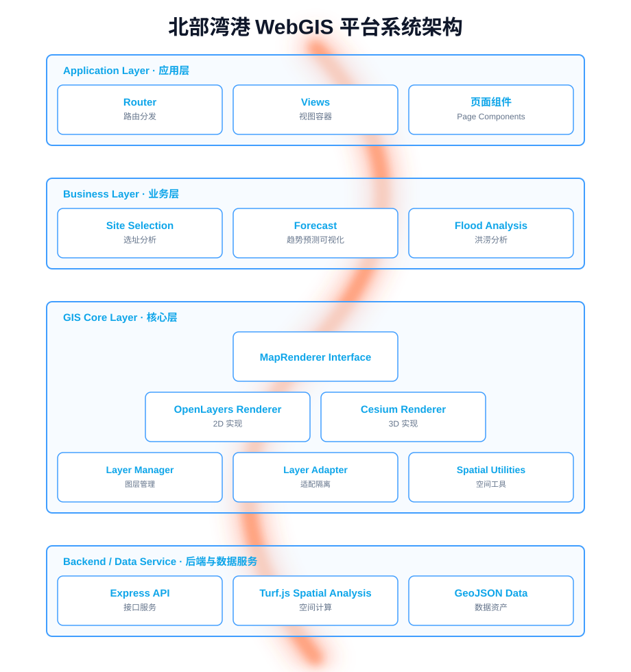
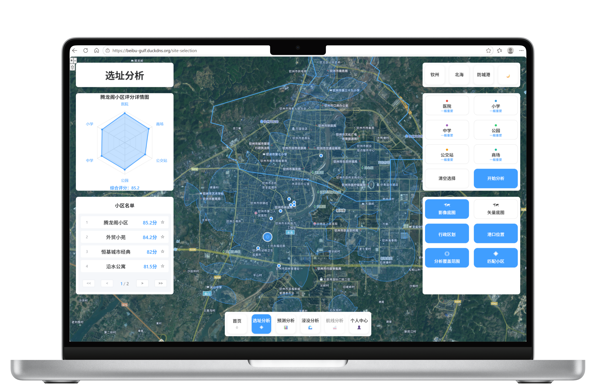
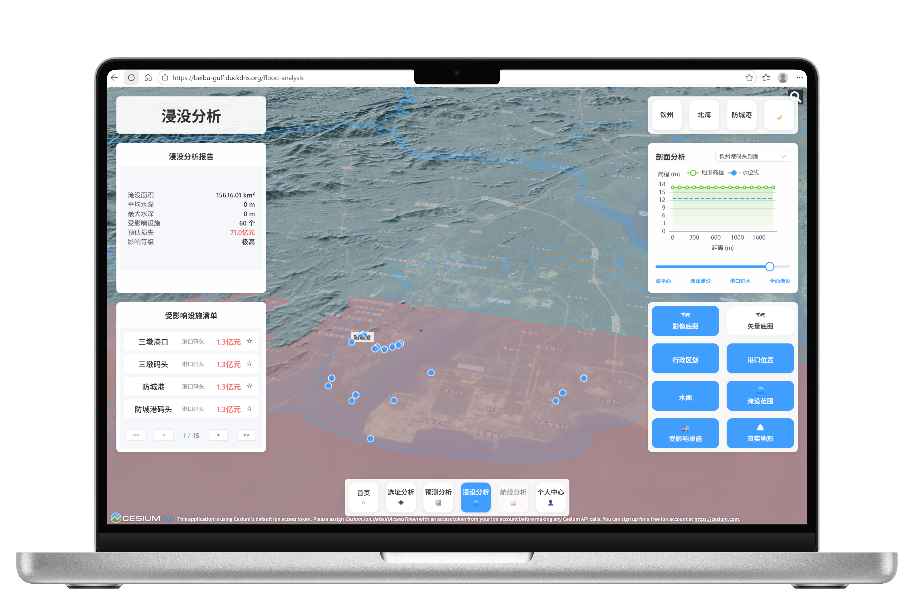
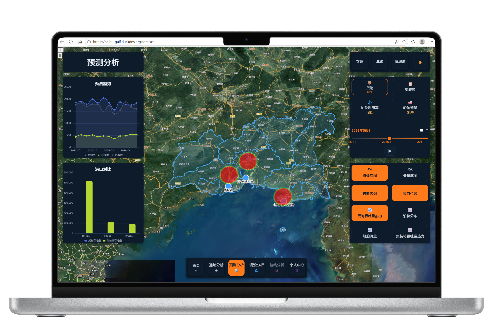

# 北部湾港智慧空间分析平台

> 一个面向智慧港口场景的 WebGIS 业务应用实践：在地图展示之上，尝试用分层架构解决 GIS 项目功能膨胀带来的维护难题。

本科 GIS 专业独立开发项目。项目以广西北部湾港（钦州）为地理背景，围绕港口空间数据分析展开，目标是验证一套可扩展的 GIS 业务系统架构，而非单纯的地图可视化 Demo。

## 核心功能

北部湾港 WebGIS 平台聚焦三类空间分析业务，并借分层架构验证 GIS 系统的可扩展性：

- **选址分析**：6 类设施多选 + 距离加权评分，后端 turf 缓冲区叠加与 RBush 面内点过滤，雷达图 6 轴评分 + 方案收藏
- **预测分析**：4 指标趋势可视化（时间轴播放 + 地图热力），cargo 走吞吐量模型产物、container 走确定性趋势外推引擎（均真数据；berth/traffic 诚实标注合成示意）
- **浸没分析**：基于真 DEM 的连通性淹没演算（FastAPI scipy 8 连通 + 海面种子），251 档预计算表查表秒回，Cesium 3D 真地形 + 水面/淹没多边形渲染

附加能力：HttpOnly Cookie 会话认证（tokenVersion 吊销）、暗色主题切换（深蓝+橙）、响应式三档布局（桌面/抽屉/紧凑）、CI 自动部署 + HTTPS 自动续期。

---

## 项目背景

当前已实现的核心能力：

- **港口空间数据展示**：基于天地图底图，叠加港口点位、行政区划、腹地范围等业务图层
- **空间分析**：选址分析模块支持多设施类型（医院、学校、公园、公交站、商场等）的缓冲区叠加与面内点过滤
- **多因素评价**：基于距离加权评分模型，对候选位置综合打分并排序
- **可视化展示**：ECharts 雷达图呈现各因子得分分布，地图交互联动分析结果

业务部分目前数据规模有限，主要用于验证 GIS 业务流程与系统架构的可行性，不追求覆盖完整业务闭环。

---

## 架构设计

项目经历过一次架构重构。重构前，随着功能增加，几个问题逐渐暴露：

- 地图渲染逻辑与业务计算逻辑交织在同一组件内
- 每个新业务都重复编写图层管理、面板布局代码
- 新增业务需要改动核心代码，2D 与 3D 的扩展路径不清晰

重构后采用分层架构，自上而下分为四层：

| 层级                  | 职责                                 |
| --------------------- | ------------------------------------ |
| **Application Layer** | 页面路由、视图装配                   |
| **Business Layer**    | 业务模块（选址分析、预测、洪涝分析） |
| **GIS Core Layer**    | 地图渲染抽象、图层管理               |
| **Component System**  | 通用组件与布局体系（GCS）            |

依赖方向单向自上而下：业务层依赖 GIS 核心，核心层不反向依赖业务。详细的分层规则与依赖约束记录在 `docs/` 下，此处不展开。

### 系统架构图

架构分层（Application → Business → GIS Core → Backend）与依赖约束见上文表格与 `docs/` 下文档；真实界面效果见下方截图。


---

## 核心设计理念

### 1. GIS 渲染抽象

项目尝试将地图能力抽象为一层渲染接口，业务模块通过统一约定与地图交互，而非直接调用具体引擎 API。当前已接入 OpenLayers（2D）与 Cesium（3D）两套渲染实现。

需要说明的是，这只是一个面向解耦的抽象尝试，并非完整的「2D/3D 统一引擎」——两套引擎的能力差异客观存在，抽象层目前覆盖的是业务高频操作（图层增删、点位绘制、视图控制），并非全部能力。这样设计的目的，是让业务代码在更换或扩展渲染方式时改动可控。

### 2. 业务模块化

业务功能按模块组织，每个模块自带状态、视图与服务调用。新增业务时，尽量在 Business Layer 内完成，避免改动 GIS Core。

目前已落地的三个模块：

- `site-selection`：选址分析（2D）
- `forecast`：吞吐量预测可视化（2D）
- `flood-analysis`：洪涝分析（3D）

模块间通过共享的图层管理器协作，而非直接相互调用。

### 3. GCS 组件布局体系

GIS 应用中，地图工具栏、分析面板、图例、详情卡片等组件数量会随业务增长快速膨胀，页面布局容易逐渐失控。GCS（Global Component Style）是项目内设计的一套组件布局约定，通过统一的网格位置约定与样式变量，集中管理这些浮动组件的位置与层级。

它解决的是「组件多了之后布局混乱」这个具体问题，而非一套通用 UI 框架。

---

## 技术栈

| 层级           | 技术                                                                                                          |
| -------------- | ------------------------------------------------------------------------------------------------------------- |
| **前端框架**   | Vue 3（Composition API + `<script setup>`）、Vite（Rolldown）、Vue Router、Pinia                              |
| **语言与类型** | TypeScript 严格模式（@ts-nocheck 全量移除）、zod 运行时校验（HTTP 边界 100%）                                 |
| **GIS 引擎**   | OpenLayers（2D）、Cesium（3D，懒加载 + 真地形瓦片）                                                           |
| **空间分析**   | Turf.js（Express 后端服务）、rbush 空间索引、scipy 连通性演算（FastAPI）                                      |
| **数据可视化** | ECharts（异步化，不进首屏关键路径）                                                                           |
| **UI 组件**    | Element Plus（按需引入）+ 自研 GCS 网格布局体系（含暗色主题 token）                                           |
| **后端**       | Node.js、Express 5（ESM，三层架构）+ FastAPI（Python 洪涝演算，独立容器）                                     |
| **数据**       | GeoJSON、JSON（createReadCache 缓存）、251 档预计算表（gzip）、DEM 流水线脚本                                 |
| **工程化**     | Vitest（前后端全量测试，用例数为动态状态，以 `npm test` 为准）、ESLint、Prettier、Husky/commitlint、dependency-cruiser 架构守护、gitleaks 密钥扫描 |
| **部署**       | Docker Compose 双容器、GitHub Actions CI 自动部署、Let's Encrypt HTTPS 自动续期                               |

---

## 数据准备（DEM 与洪涝分析）

洪涝分析模块依赖 ASTER GDEM 30m 真实栅格。仓库内的产物与 git 忽略的产物分工如下：

| 文件                                                                                                | 状态                                               | 用途                                                                   |
| --------------------------------------------------------------------------------------------------- | -------------------------------------------------- | ---------------------------------------------------------------------- |
| `backend/static/dem/dem_hillshade.tif`                                                              | ✅ 已入 git（COG：6 级 overview + 512 分块 + LZW） | 2D 洪涝页「真实地形」图层，浏览器按 tile 拉取                          |
| `backend/static/dem/dem_hillshade.png`                                                              | ✅ 已入 git（5.8MB）                               | 3D 山体阴影叠加层（真地形就绪后仅作明暗增强）                          |
| `backend/static/terrain/`（CTB 瓦片 z0-12，3848 文件）                                              | ✅ 已入 git                                        | Cesium 真 3D 地形（heightmap 瓦片，z 值起伏）                          |
| `backend/data/flood/dem/filled_utm48n_cut.tif`（约 169MB）                                          | 🚫 gitignored，需本地生成                          | 洪涝 **online** 演算输入（连通性演算）                                 |
| `backend/data/flood/*.json`（facilityPoints 83 设施 / floodArea / floodStatistics / water-area 等） | ✅ 已入 git                                        | 洪涝设施影响评估（高德真实 POI）与 api 模式数据                        |
| `backend/data/flood/flood_levels.json.gz`（2.9MB，251 档）                                          | ✅ 已入 git                                        | 洪涝预计算档位表（0~25m/0.1m 步长，查表秒回，Express 与 FastAPI 共用） |

**clone 后注意事项**：`filled_utm48n_cut.tif`（169MB）不在仓库中。**但它只影响"查表 miss 的越界档位"现场演算**——0~25m 全部 251 档预计算表已入库，**clone 即用、开箱秒回**；DEM 缺失时仅越界档位无法现场演算（前端不会触发）。

**flood-service（FastAPI）部署**：`backend/flood-service/`（main/flood_engine/precompute_levels/tests + Dockerfile）**已入 git**。生产已容器化（docker-compose 双容器，nginx 经 `flood-service:8000` 内网反代，不暴露公网）；本地开发 `npm run dev:flood` 一键启动（跨平台 venv 解析）。

**DEM 生成流水线**：`tools/dem-pipeline/`（01-mosaic → 02-fill-sinks → 03-reproject-4326 → 04-generate-flood-data → 05-fix-facility-elevation）。脚本为 Windows PowerShell + QGIS GDAL 环境，且输入路径硬编码了本地目录（ASTER GDEM 30m 原始 tile），在其它机器上运行需按本机环境调整路径与 GDAL 位置。完整步骤见各脚本头部注释。

**洪涝在线演算服务**（`backend/flood-service`，FastAPI + uvicorn，端口 8000）：

- 首次运行需创建 Python venv 并安装依赖：`cd backend/flood-service && python -m venv .venv && .venv/Scripts/pip install -r requirements.txt`（Windows；macOS/Linux 将 `Scripts` 换为 `bin`）
- 启动脚本 `npm run dev:flood` 已跨平台（`tools/run-flood.cjs` 自动按平台解析 venv 解释器）；Windows 下亦可直接运行 `backend/flood-service/start.bat`

---

## 项目展示

### 选址分析页面



选址分析模块支持多设施类型（医院、学校、公园、公交站、商场等）的缓冲区叠加与面内点过滤，基于距离加权评分模型对候选小区综合打分并排序。

### 洪涝分析 DEM 图层



基于真 DEM 的连通性淹没演算（FastAPI scipy 8 连通 + 海面种子），251 档预计算表查表秒回；3D 模式叠加真地形瓦片（CTB z 值起伏）。

### 暗色模式



一键切换暗色主题（深蓝底 + 高饱和橙），全站 token 化（CSS 变量覆盖，图表同步适配）。

---

## 快速开始

### 环境要求

- Node.js ≥ 22.18、npm
- Docker（可选，仅容器部署用）

### 安装

```bash
git clone <repo-url>
cd beibu-gulf-project
npm install
cd backend && npm install
```

### 必需环境变量

两份 `.env` 文件（均不入 git），缺失时对应能力不可用：

```bash
# 根目录 .env（前端构建注入）
VITE_TIANDITU_KEY=<天地图 key，申请：https://console.tianditu.gov.cn>

# backend/.env（后端运行时）
JWT_SECRET=<32+ 字符随机串，否则后端启动即抛错>
```

### 本地启动

前后端分别启动：

```bash
# 终端 1：前端
npm run dev

# 终端 2：后端
npm run dev:server
```

或一键启动：

```bash
npm run dev:all
```

前端默认 `http://localhost:5173`，后端默认 `http://localhost:3000`。地图/选址/预测/洪涝 api 模式全部可用（数据文件已入库）。

### 洪涝 online 模式（连通性演算，可选）

```bash
# 1. 建 Python 环境（首次）
python -m venv backend/flood-service/.venv
backend/flood-service/.venv/Scripts/pip install -r backend/flood-service/requirements.txt

# 2. 起 FastAPI（另开终端）
npm run dev:flood   # uvicorn :8000，预计算表查表秒回

# 3. 前端切 online
#    frontend/.env.local 加 VITE_DATA_SOURCE=online
```

### 构建与分析

```bash
npm run build            # 前端生产构建
npm run build:analyze    # 附带体积分析报告（dist/stats.html）
```

### 部署

项目提供 Docker Compose 双容器编排（WebGIS 主容器 + flood-service 演算容器）+ GitHub Actions CI 自动部署：

```bash
docker compose up --build -d
```

- **CI 流水线**（4 job）：audit → lint-and-build（format/lint/cruise/typecheck/gitleaks/测试/build）→ backend-tests → deploy（main 分支 SSH 自动部署）
- **HTTPS**：Let's Encrypt + duckdns DNS-01，自动续期（certbot.timer + deploy hook）
- 生产数据源由 `VITE_DATA_SOURCE` 构建期注入（`online` = 洪涝走 FastAPI 连通性演算；`api` = Express 251 档查表）
- 详见 `Dockerfile`、`docker-compose.yml`、`nginx.conf`

---

## 关于这个项目

这是一个学习性质的个人项目，目的是把课堂上的 GIS 知识落到一个能跑起来的全栈系统里，并在过程中理解 WebGIS 项目的架构问题。代码与文档欢迎交流，但请勿用于任何商业用途。
